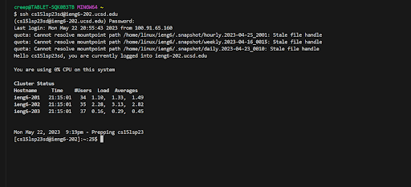
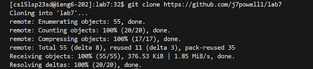
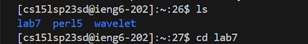
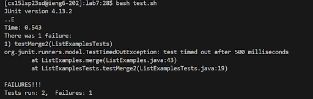
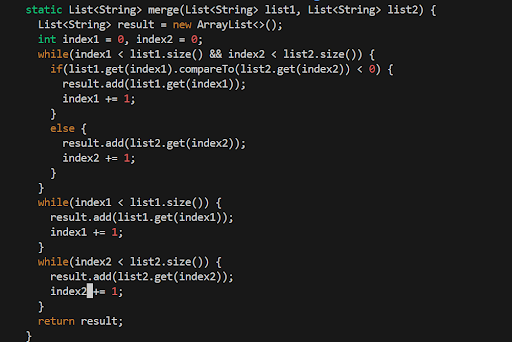
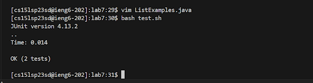

# Step 4 To begin I logged into my CS15L account:
***

***
# Step 5 Then I cloned the repo:
***

***
## This was done with the keys:
***
keys: "ctrl" + "r" "git" "enter"
***
# Step 5.5 After that I ls'd and used cd into lab7 via the keys:
***
Keys: "ls" "ctrl" + "r" "enter"
***

***
Following this I used the keys:
***
"ctrl"+"R" "ba" "enter"
***
# Step 6 This let me run a test to see the number of failures the code provided
***

***
Once I saw the failures from step 6 I used vim in the code with the keys 
***
Keys: "ctrl"+"r" "vim"
***
# Step 7 After going into the code I changed the last while statement via the keys:
***
Keys: "k" "k" "h" "h" "del" "i" "2" "esc"
***

***
After that I pressed the following in order to save and exit:
***
Keys: ":" "w" "q" "enter"
***
# Step 8 Then I ran the test one last time to see if they pass which they did:
***
Keys:"ctrl"+"r" "b" "a" "enter"
***

